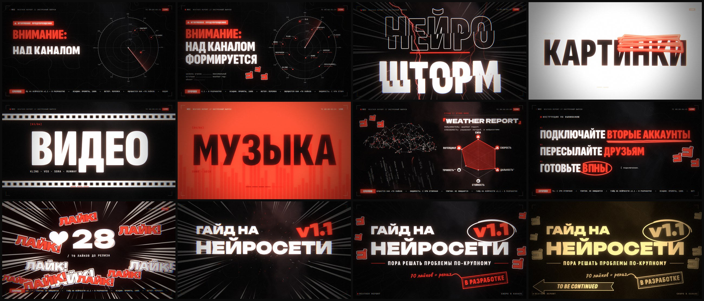

# НЕЙРОШТОРМ — 10-секундный моушн-тизер, собранный кодом


Тизер-трейлер «Гайд на нейросети v1.1» для Telegram-канала. Концепт — экстренный выпуск прогноза погоды: над каналом формируется нейрошторм. Внутри отсылки к JoJo: стенд 「Weather Report」, ゴゴゴ, раш «ЛАЙК! ЛАЙК!» вместо ORA ORA и финальный TO BE CONTINUED.

▶ **[Смотреть видео — MP4, 1080p60, со звуком](media/teaser.mp4)**



## Что внутри

- **10 секунд, 1920×1080, 60 fps** — пять тактов по 120 BPM. Картинка и звук читают один таймлайн (`src/timeline.js`), поэтому каждый удар в кадре совпадает с ударом в звуке.
- **Рендер** — Canvas 2D (кинетическая типографика, HUD, 3D-проекция нейро-облака) поверх WebGL2 (процедурный фон: облака на domain-warped fbm, изобары, радар с халфтон-эхо, манга-спидлайны).
- **Честный моушн-блюр** — 16 субкадров на кадр, накопление во float-буфере, затвор 180°.
- **Пост-обработка** — bloom, хроматическая аберрация, глитч, шоквейв, дуотон-вспышки, сепия для стоп-кадра, плёночное зерно.
- **Звук синтезирован с нуля** в Web Audio (OfflineAudioContext): кики, 808, braam, гром, райзеры, пэды, фонк-ковбелл, Karplus-Strong. Ни одного сэмпла.
- **Детерминированный покадровый рендер** — headless Chrome отдаёт кадры, ffmpeg собирает H.264 + AAC.

## Раскадровка

| Время | Сцена |
|---|---|
| 0–2 с | Экстренный выпуск: радар ловит нейросети как грозовые ячейки, бегущая строка с прогнозом, зум в центр |
| 2–4 с | Слэм «НЕЙРОШТОРМ» с молниями, затем по восьмым: тексты, картинки, видео, музыка, код, агенты |
| 4–6 с | Карточка стенда: 3D нейро-облако с дождём из промптов и шестиугольник характеристик |
| 6–8 с | Инструкция по выживанию и раш «ЛАЙК!» со счётчиком до 70, затем тишина |
| 8–10 с | Дроп: титр, штамп «В разработке», стоп-кадр в сепии и TO BE CONTINUED |

## Запуск

Нужны Node.js 18+, Chrome или Edge и `ffmpeg` в `PATH`.

```bash
npm install
npm run render   # видео со звуком -> out/weather_report_teaser.mp4
npm run stills   # кадры каждые 0.25 с -> out/stills/
npm run audio    # только звук -> out/audio.wav
```

Путь к браузеру можно задать переменной `CHROME_PATH`. Число субкадров моушн-блюра — второй аргумент: `node render.mjs video 16`.

## Структура

```
src/timeline.js         тайминги всех событий (общие для картинки и звука)
src/scenes/*.js         сцены: радар, шторм и категории, стенд, призыв и раш, титр
src/gl.js               WebGL2-пайплайн: фон, накопление блюра, bloom, пост
src/lib/                easing, шум, типографика, молнии, маркерные скриблы
src/audio.js            партитура
src/audio/synth.js      синтезаторы и эффекты
render.mjs              драйвер: локальный сервер, headless Chrome, ffmpeg
tools/sheet.py          контакт-листы из кадров
```

Шрифты: Unbounded, Sofia Sans Extra Condensed, JetBrains Mono, Caveat, Dela Gothic One (Fontsource, SIL OFL).
